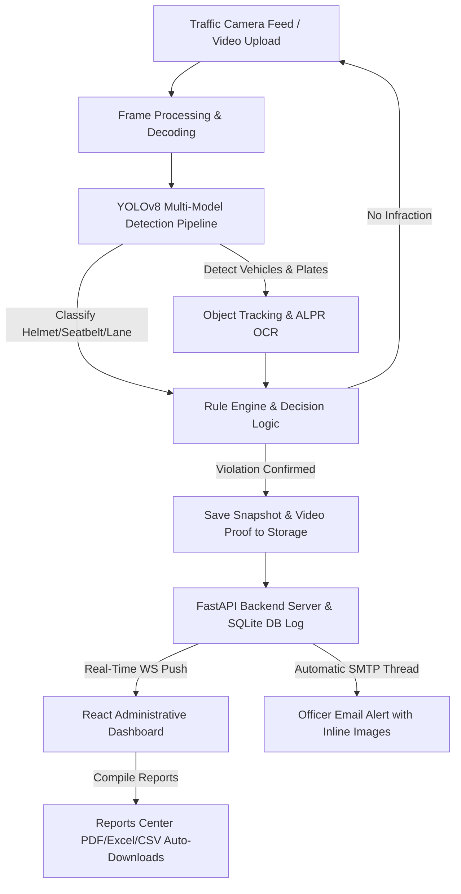

# 🚓 AURA Traffic Monitor: AI Infraction System

An advanced, real-time traffic monitoring, AI-powered violation detection, and administrative management ecosystem. This project combines computer vision (YOLO, custom classifiers) with a responsive admin console to detect, log, and alert officers about traffic infractions (such as speeding, red-light jumping, helmet violations, seatbelt non-compliance, and lane crossings).

---

## 📌 Project Overview & Architecture

Below is the execution flow of the AURA Traffic Monitor system, from live camera feed input to database logging, officer alert dispatch, and administrative review.



---

## 🛠️ Technology Stack & Core Engines

| Layer | Technologies | Purpose |
|---|---|---|
| **AI Bounding & Track** | Python, YOLO11, ByteTrack, OpenCV | Real-time vehicle detection, tracking, and velocity estimation. |
| **Custom Classifiers** | PyTorch, YOLOv8 Custom Weights | Custom trained models for helmet detection, seatbelt compliance, and traffic light OCR. |
| **Backend Framework** | Python, FastAPI, Uvicorn | High-performance async APIs, WebSockets, background tasks, and SMTP delivery. |
| **Database** | SQLAlchemy, SQLite / PostgreSQL | Relational database storing infraction metadata, camera registries, and email logs. |
| **Frontend UI** | React 19, Vite, Vanilla CSS | Premium, fully custom-themed (Light/Dark) interactive control deck. |
| **Mail Dispatcher** | SMTP, Jinja2 Templates, MIME Multipart | Automated email alerts with embedded evidence images and video attachments. |

---

## ✨ Features & Capabilities

### 1. Computer Vision & Multi-Model Pipeline
* **YOLOv8/11 Vehicle Detection**: Locates cars, trucks, motorcycles, and buses in real time.
* **Automatic License Plate Recognition (ALPR)**: Custom OCR model extracts license plate text automatically from zoomed-in crops.
* **Helmet Classifier**: Evaluates motorcycle riders to ensure compliance with helmet safety laws.
* **Seatbelt Classifier**: Detects front-seat occupants and identifies seatbelt usage.
* **Traffic Light & Lane Intelligence**: Monitors vehicles crossing stop lines or executing illegal lane modifications.

### 2. FastAPI Backend Services
* **WebSocket Streams**: Pushes live detection frames, bounding boxes, and statistics directly to connected clients.
* **Enterprise Reports Center**: Async generation of daily, weekly, or monthly reports in PDF, Microsoft Excel (`.xlsx`), or CSV formats.
* **Persistent Settings Service**: Stores email servers, thresholds, timezone, theme, and language parameters to file (`system_settings.json`).
* **Automated SMTP Dispatcher**: Triggers background mail alerts to officer list using secure Google/Gmail App Password authentication.

### 3. React / Vite Administrative Console
* **Control Deck Dashboard**: Dynamic visualization charts of live infraction counts, confidence distributions, and database health.
* **Live Monitoring**: Real-time stream player rendering bounding box overlays and real-time alert logs.
* **Camera Management**: Registry console to add new feeds, toggle recording status, and specify connection endpoints.
* **Comparison Upload Area**: Side-by-side player comparing original footage with AI-annotated frames.
* **Evidence Locker**: Central audit archive for downloading logs, inspecting snapshots, and playing violation clips.
* **Real-Time Configuration Deck**: Instant theme changes (Dark/Light mode) and translation switching (Hindi, Spanish, English) without delay.

---

## 📂 Project Directory Structure

```text
Traffic-violation-Project/
├── traffic-violation-system/
│   ├── app/                      # FastAPI Backend Source
│   │   ├── api/v1/routes/        # Endpoints (Reports, Evidence, Settings, WS)
│   │   ├── core/                 # Logger and configuration loading
│   │   ├── database/             # SQLAlchemy schemas, models, and migrations
│   │   ├── schemas/              # Pydantic request/response models
│   │   ├── services/             # Core Business Logic
│   │   │   ├── email/            # SMTP services, Jinja2 email templates
│   │   │   ├── evidence/         # Database operations for violation logging
│   │   │   └── settings/         # File-based settings persistence
│   │   └── main.py               # API Entrypoint
│   ├── frontend/                 # React Vite Frontend Source
│   │   ├── src/
│   │   │   ├── components/       # Reusable panels (Charts, Tables, Players)
│   │   │   ├── pages/            # View Pages (Dashboard, Settings, Reports)
│   │   │   ├── services/         # Axios API connection endpoints
│   │   │   └── index.css         # Global stylesheets and theme tokens
│   │   └── package.json          # NPM Dependencies
│   ├── models/                   # AI weights (.pt files)
│   ├── uploads/                  # System data (configs, logs, email lists)
│   ├── reports/                  # Generated PDF/Excel/CSV exports
│   ├── requirements.txt          # Python packages
│   └── test.db                   # Local SQLite Database
├── sync.ps1                      # Automatic Git synchronization script
└── README.md                     # Main documentation
```

---

## 🚀 Installation & Setup Guide

### Prerequisites
* **Python**: `3.10` or higher
* **Node.js**: `18.0` or higher
* **Git**

---

### Step 1: Clone the Repository
```bash
git clone https://github.com/Jaspreet-93/Traffic-violation-Project.git
cd Traffic-violation-Project
```

---

### Step 2: Backend Setup
1. Navigate to the backend directory:
   ```bash
   cd traffic-violation-system
   ```
2. Create and activate a Python virtual environment:
   ```bash
   python -m venv venv
   # On Windows:
   .\venv\Scripts\Activate.ps1
   # On macOS/Linux:
   source venv/bin/activate
   ```
3. Install dependencies:
   ```bash
   pip install -r requirements.txt
   ```
4. Copy the environment variables template and configure it:
   ```bash
   cp .env.example .env
   ```
5. Start the FastAPI backend server:
   ```bash
   uvicorn app.main:app --port 8000 --reload
   ```
   * The API server will start at: **`http://localhost:8000`**
   * Access the interactive API docs at: **`http://localhost:8000/docs`**

---

### Step 3: Frontend Setup
1. Open a new terminal window and navigate to the frontend directory:
   ```bash
   cd traffic-violation-system/frontend
   ```
2. Install npm dependencies:
   ```bash
   npm install
   ```
3. Start the development server:
   ```bash
   npm run dev
   ```
   * The dashboard will start at: **`http://localhost:3000`**

---

## ⚙️ SMTP Alert Configuration
To dispatch automatic email alerts to officers when a violation is identified:
1. Turn on **2-Step Verification** in your Google Account.
2. Generate a **Google App Password** (16 characters) under Account Security.
3. Open the **System Settings** page in the frontend Dashboard.
4. Input your Gmail address and the 16-character App Password under the **SMTP Server** tab, then save the configuration.

---

## 🤖 Automatic Git Synchronization
This workspace automatically synchronizes local changes. If you are developing locally, you can trigger a manual synchronization by executing:
```powershell
.\sync.ps1
```
This will automatically stage, commit, and push all workspace changes to the remote repository.
