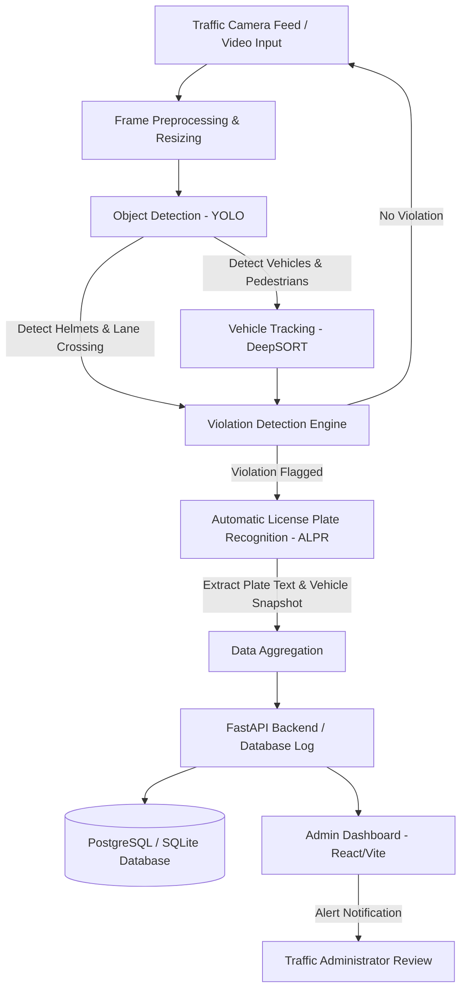

# AI-Powered Traffic Violation Detection & Management System

An automated, real-time traffic monitoring and violation detection system utilizing computer vision, deep learning, and a modern web dashboard. This project acts as a complete solution for smart city traffic administration, detecting violations such as speeding, red-light jumping, helmet violations, and unauthorized lane crossing.

---

## 📌 System Architecture & Execution Flow

Below is the high-level operational pipeline of the traffic violation detection system, from the camera feed input to the final database record and dashboard notification.



---

## 🛠️ Technology Stack

| Component | Technology | Description |
|---|---|---|
| **Computer Vision** | Python, OpenCV, YOLOv8/v9 | Video frame processing, object detection, and tracking. |
| **ALPR Engine** | EasyOCR / Tesseract / PaddleOCR | License plate text extraction from vehicle snapshots. |
| **Backend API** | Python, FastAPI / Flask | RESTful APIs for managing violation logs, user authentication, and reports. |
| **Database** | PostgreSQL / SQLite | Relational database to store violation details, vehicle logs, and admin credentials. |
| **Frontend UI** | React, Vite, Vanilla CSS / Tailwind | Modern admin panel for real-time alerts, violation analytics, and ticket management. |
| **Deployment** | Docker, Docker-compose | Containerization for easy setup and reproducibility. |

---

## 📂 Project Structure

```text
Traffic-violation-Project/
├── .agents/                 # Workspace-scoped agent custom rules
├── api/                     # FastAPI Backend Server
│   ├── app/
│   │   ├── main.py          # API Entrypoint
│   │   ├── models.py        # SQLAlchemy Database Models
│   │   ├── schemas.py       # Pydantic Schemas
│   │   └── routes/          # API Route Controllers
│   ├── requirements.txt     # Python Dependencies
│   └── database.db          # Local SQLite DB (for development)
├── pipeline/                # Computer Vision & Detection Pipeline
│   ├── models/              # Pretrained YOLO weights
│   ├── tracker/             # Vehicle tracking algorithms
│   ├── detect.py            # Main detection script
│   └── config.yaml          # Configuration (lane regions, speed limits)
├── dashboard/               # React Frontend Dashboard
│   ├── src/                 # Frontend source code
│   ├── package.json         # NPM Dependencies
│   └── index.html           # Main HTML file
├── sync.ps1                 # Automatic Git synchronization script
└── README.md                # Project documentation
```

---

## 🚀 Execution & Command Reference

### 1. Computer Vision Pipeline (Detection)
To run the violation detection pipeline on a video file or live RTSP stream:
```bash
# Navigate to the pipeline directory
cd pipeline

# Run detection on a video file
python detect.py --source input_traffic.mp4 --violation speeding

# Run detection on a live webcam/RTSP stream
python detect.py --source rtsp://your_camera_ip:port/h264
```

### 2. Backend API Setup
To start the FastAPI backend server:
```bash
# Navigate to the API directory
cd api

# Install Python dependencies
pip install -r requirements.txt

# Run the backend using Uvicorn
uvicorn app.main:app --reload --host 127.0.0.1 --port 8000
```

### 3. Frontend Dashboard Setup
To run the React administrative dashboard locally in development mode:
```bash
# Navigate to the dashboard directory
cd dashboard

# Install NPM dependencies
npm install

# Run the development server
npm run dev
```

---

## 🤖 Automatic Git Synchronization

This project is configured with automatic Git synchronization. At the end of every task or prompt session, the workspace changes are staged, committed, and pushed to the remote repository.

To manually trigger a synchronization, run the following command in PowerShell:
```powershell
.\sync.ps1
```
