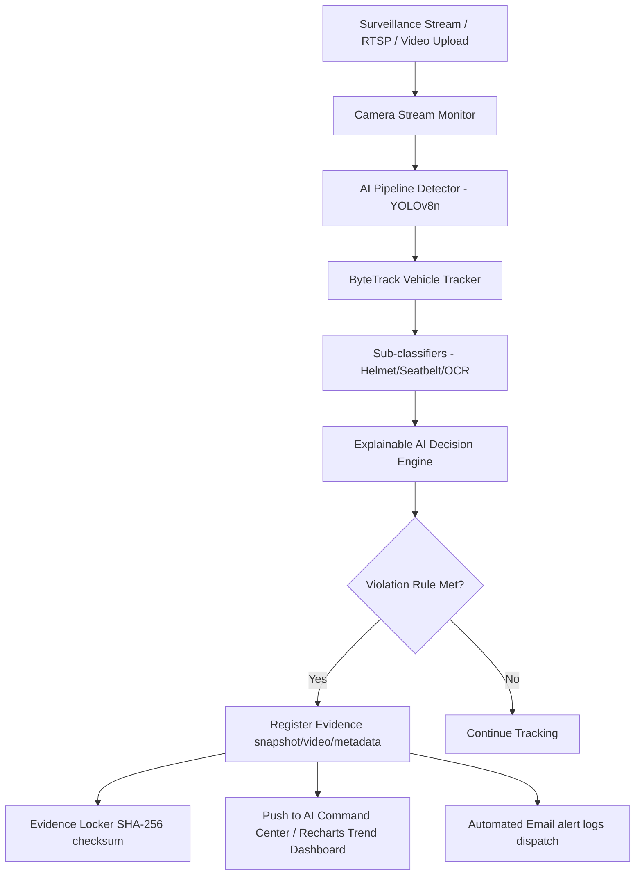

# AI-Based Smart Traffic Violation Detection System (AURA Engine)

A production-ready, full-stack real-time computer vision system that monitors video streams, identifies vehicle tracks, and runs AI classifiers to log traffic violations (such as helmet requirements, seat belts, traffic lights, and phone usage).

---

## 📸 System Architecture & Execution Flow

Below is the flowchart representing the execution flow of the AURA Engine processing pipeline:



---

## 🛠️ Technology Stack

- **Backend**: FastAPI, Pydantic, SQLAlchemy, Uvicorn, PyTorch, YOLOv8, OpenCV, ByteTrack, Python 3.10+
- **Database**: PostgreSQL (with automatic mock fallback handlers when offline)
- **Frontend**: React, Vite, Vanilla CSS, Recharts, Lucide Icons, Axios, React Router v6
- **Deployment**: Docker, Docker Compose, Nginx

---

## 📂 Folder Structure

```text
traffic-violation-system/
│
├── app/
│   ├── api/
│   │   └── v1/
│   │       ├── routes/          # Routers (camera_management, statistics, reports, settings, model_verification)
│   │       └── router.py        # Central Router registration
│   ├── database/
│   │   ├── models/              # SQLAlchemy Models (Camera, Violation, Evidence)
│   │   └── connection.py        # Lifecycle DB Session managers
│   ├── services/
│   │   ├── camera_management/   # Camera stream recording health checks
│   │   ├── statistics/          # Statistics aggregating services
│   │   ├── reports/             # PDF/CSV/Excel report compiles
│   │   ├── settings/            # SMTP and AI threshold settings
│   │   └── model_verification/  # AI models weight check diagnostics
│   └── main.py                  # Entrypoint mounting static resources and CORS
│
├── frontend/                    # Vite + React SPA dashboard client
│   ├── src/
│   │   ├── components/          # Camera, statistics, reports, settings, model components
│   │   ├── pages/               # Dashboard, Violations, ReplayCenter, EvidenceLocker, ModelVerification
│   │   └── services/            # Axios API wrappers
│   └── vite.config.js           # Proxy configurations
│
├── deployment/                  # Docker container configs
│   ├── docker-compose.yml       # Stack coordinator (db, backend, frontend, nginx)
│   └── nginx/nginx.conf         # Ingress reverse proxy configuration
│
└── tests/                       # Unit and Integration test scripts
```

---

## 🚀 Running Instructions

### 1. Local Development Execution

#### A. Backend Setup
1. Activate virtual environment:
   `.\venv\Scripts\Activate.ps1` (Windows) or `source venv/bin/activate` (Unix)
2. Run backend dev server:
   ```bash
   uvicorn app.main:app --reload --port 8000
   ```
   Swagger API Docs will be available at: `http://127.0.0.1:8000/docs`

#### B. Frontend Setup
1. Install packages:
   ```bash
   cd frontend
   npm install
   ```
2. Start Vite client:
   ```bash
   npm run dev
   ```
   Open `http://localhost:3000` (or the printed port) in your browser.

---

### 2. Docker Production Compose
Build and spin up the complete containerized full stack:
```bash
cd deployment
docker-compose up -d --build
```
Access points:
- **Frontend Dashboard client**: `http://localhost`
- **Interactive API Swagger Docs**: `http://localhost/docs`

---

## 🛠️ Testing Reference
Execute all discoverable unit tests from the backend project root folder:
```bash
$env:PYTHONPATH="."
python -m unittest discover -s tests -p "test_*.py"
```
Output:
```text
Ran 65 tests in 82.037s
OK
```
